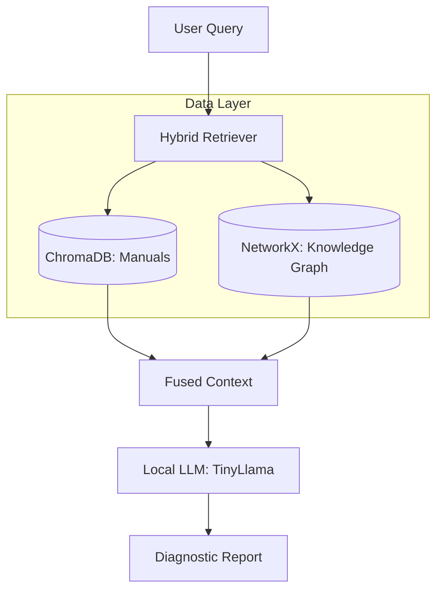

# MercMechanic: Technical Architecture 🏗️

This document explains the internal workings of MercMechanic, a Hybrid RAG (Retrieval-Augmented Generation) system designed for Mercedes-Benz diagnostic assistance.

---

## 🏗️ System Overview

MercMechanic combines **Large Language Models (LLMs)** with **Vector Databases** and **Knowledge Graphs** to provide precise, context-aware vehicle diagnostics. It operates entirely locally for privacy and speed.



---

## 🧩 Component Breakdown

### 1. Ingestion Pipeline (`src/ingestion.py`)
Responsible for processing raw data and building the search indices.
- **Vector Ingestion**:
    - Uses `pypdf` to extract text from multi-thousand-page PDFs.
    - Implements **Batch Processing** (50-page increments) to prevent memory overflows.
    - Embeds text using `all-MiniLM-L6-v2` and stores it in **ChromaDB**.
- **Graph Ingestion**:
    - Reads structured relationships from `data/knowledge_graph.json`.
    - Builds a directed graph using `NetworkX` and exports it as a `.gpickle` file.

### 2. Retrieval Engine (`src/retrieval.py`)
The core reasoning component that fuses different data sources.
- **Semantic Search**: Queries ChromaDB for the top-N most similar text segments.
- **Graph Traversal**: 
    - Scans the query and retrieved documents for known entities (e.g., "ABS", "Battery").
    - Traverses the graph to find immediate neighbors and second-degree relationships.
- **Context Fusion**: Combines manual text and graph relationships into a single text block for the LLM.

### 3. LLM Client (`src/llm_client.py`)
Interfaces with local inference engines.
- **Ollama Integration**: Dynamically detects and uses local models.
- **Model Hierarchy**: Prioritizes `tinyllama` (for speed), then `phi3`, then `llama3`.
- **Mock Fallback**: Includes a deterministic mock mode for testing without a running LLM.

---

## 🛠️ Key Workflows

### The Hybrid Retrieval Process
1. **Query**: "My car shakes when I brake."
2. **Vector Retrieval**: Finds manual sections describing "vibration during braking" or "warped rotors."
3. **Entity Extraction**: Identifies entities like "Brake Pads" or "Brake Wear Sensor" from the text.
4. **Graph Expansion**: Fetches rules like `Brake Pads --[monitored_by]--> Brake Wear Sensor`.
5. **Prompt Injection**: Inserts both the manual's raw text and the graph's logic into the system prompt.

---

## 📈 Performance & Optimization
- **Privacy**: 100% local; no data ever leaves the machine.
- **Efficiency**: Batch processing allows handling of files >500MB on standard consumer laptops.
- **Pruning**: The graph retriever uses a configurable `depth` parameter (default: 1) to keep the context window manageable.

---

## 🚀 Getting Started
To rebuild the entire brain and start diagnosing:
```powershell
python src/main.py --rebuild
python src/main.py "Why is my battery icon red?"
```
